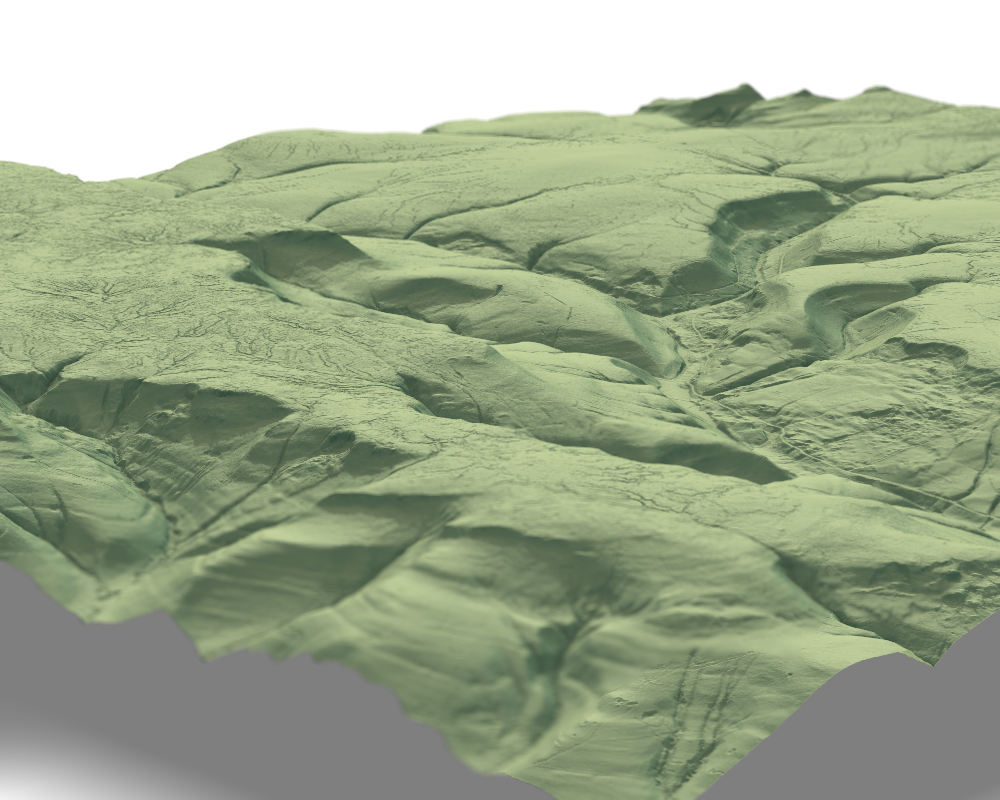

---
---

<link rel="stylesheet" href="styles.css" type="text/css">

\
\
\
\

### For software and data anlysis code check out these GitHub links:

\

#### [Hugh's GitHub Page](https://github.com/h-a-graham)

and

#### [The CREWW GitHub Page](https://github.com/exeter-creww)

\
\
\
\

### Highlights:

#### [EAlidaR](https://github.com/h-a-graham/EAlidaR) 
An R package to download EA LiDAR composite data for England

#### [sfm_precision](https://github.com/exeter-creww/SFM_Precision/tree/master/sfm_precision)
A python plugin for Agisoft Metashpae to carry out precision analysis as originally proposed in [James, et al. (2017)](https://onlinelibrary.wiley.com/doi/full/10.1002/esp.4125) but with all calculations done within Metashape/python.

#### [sfm_gridz](https://github.com/exeter-creww/SFM_Precision/tree/master/sfm_gridz)
A python package to conduct robust raster-based change detection analysis with consideration of sfm precision derived in from the sfm_precision metashape plugin
