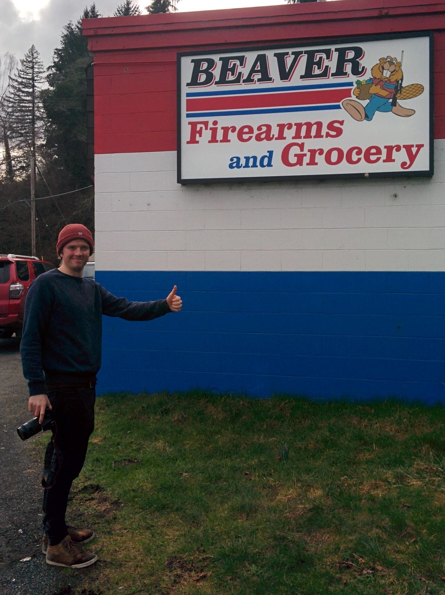

---
---

<link rel="stylesheet" href="styles.css" type="text/css">

\
I am a Geography PhD Student/Researcher at the [University of Exeter](http://geography.exeter.ac.uk/index.html) looking into the impact of reintroducing beaver in Great Britain. 

As nature’s engineers, beavers have a substantial impact on our river systems. My research aims to quantify the impacts of beaver reintroduction whilst providing information critical to their future management.

Key areas of interest include: the use of geospatial modelling to understand beaver habitat and population dynamics, using drones to quantify the impact of beaver on riparian vegetation structure and quantifying the impact of beaver dams on hydrological regimes.

For further information please see:

[Google Scholar](https://scholar.google.co.uk/citations?user=liRn8cYAAAAJ&hl=en) 

My full CV is available [here](files/Hugh_Graham_CV.pdf).