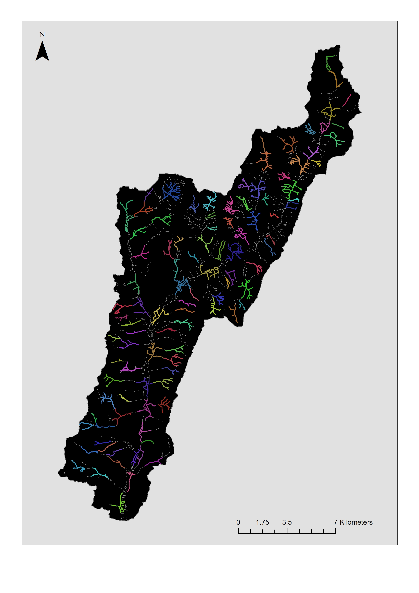

---
---

<link rel="stylesheet" href="styles.css" type="text/css">

\
\
\
\

* Beaver havitat Modelling for Great Britain

* Beaver Dam Capacity Modelling

* Quantifying the impact of Beaver dams on Hydrology

* Mapping the population expansion of Beaver in the River Otter

* Modelling beaver territory carrying capacity of the River Otter

* Investigating the impact of beaver dams on macroinvetebrate communities.